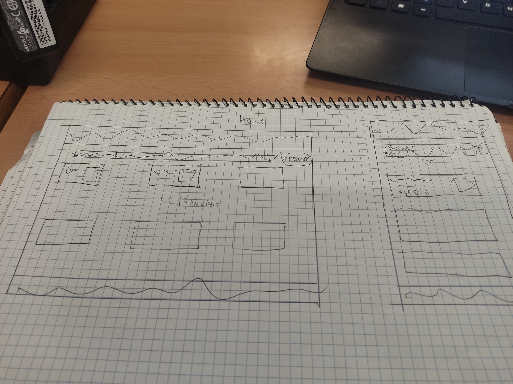

= ShowTickt: Mockups
:Author: Brian Tobias Arrua, Joan Galindo, Camilo Jumelle
:doctype: book
:encoding: utf-8
:lang: ca
:toc: right
:numbered:

== Header y Footer

=== Sketch

=== Modkup

image::images/mokups/Footer.jpg[]

=== Vista

== Home

=== Sketch

=== Modkup

image::images/mokups/Home.jpg[]

=== Vista

image::images/pantallas/homer.JPG[]

== Buscador

=== Sketch

image::images/sketch/Buscador.jpg[]

=== Modkup

image::images/mokups/Buscar.jpg[]

=== Vista

image::images/pantallas/Buscare.JPG[]

== Ver Eventos

=== Sketch

image::images/sketch/mostrarEvent.jpg[]

=== Modkup

image::images/mokups/ShowEvent.jpg[]

=== Vista

== Confirmar compra

=== Sketch

image::images/sketch/confirmo.jpg[]

=== Modkup

image::images/mokups/confirmare.jpg[]

=== Vista

image::images/pantallas/confirmar.JPG[]

== Login

=== Sketch

image::images/sketch/logine.jpg[]

=== Modkup

image::images/mokups/loginare.jpg[]

=== Vista

image::images/pantallas/login.JPG[]

== Recuperar Contraseña

=== Sketch

image::images/sketch/recupers.jpg[]

=== Modkup

image::images/mokups/olvidada.jpg[]

=== Vista

== Cambio contraseña

=== Sketch

image::images/sketch/recuperar2.jpg[]

=== Modkup

image::images/mokups/recuperar.jpg[]

== Home Promotor

=== Sketch

image::images/sketch/Homepromotor.jpg[]

=== Modkup

image::images/mokups/promotor.jpg[]

=== Vista

== Administrar Evento

=== Sketch

=== Modkup

image::images/mokups/AdministrarEvento.jpg[]

=== Vista

== Editar Evento

=== Sketch

image::images/sketch/EditarEventt.jpg[]

=== Modkup

image::images/mokups/EditarEvent.jpg[]

=== Vista

== Crear Evento

=== Sketch

=== Modkup

image::images/mokups/CrearE.jpg[]

=== Vista

image::images/pantallas/Crear.JPG[]
